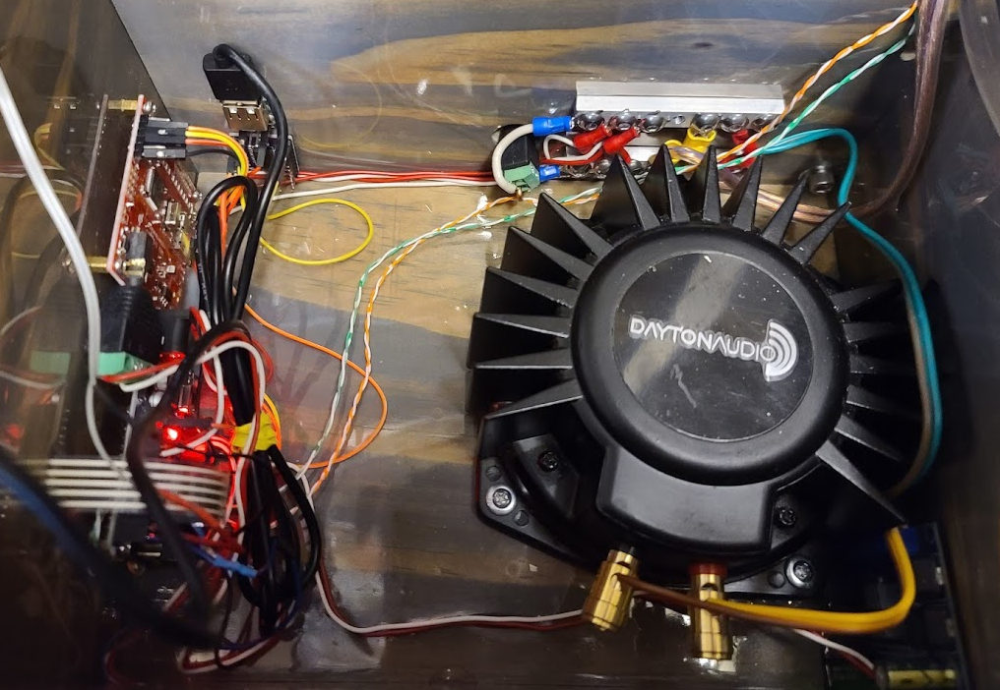

# Overview

The CloudLamp hardware accomplishes three goals:

* Command LED strip (cloud lightning, sunlight, etc)
* Play thunder sounds
* Pump water to the cloud for rain

An Arduino Uno in the base serves as the interface for all of the hardware in the base, linked via serial communication to the ESP32 in the cloud which handles all of the operational logic.  Thunder sounds are pre-generated as WAV files and played back (with polyphony) with a dedicated "WAV Trigger" board, commanded via serial interface from the Arduino Uno.  The audio amplifier is a separate board physically controlled by the user which drives a bass shaker.  The water pump is driven by a ULN2803 (which connects or disconnects ground) controlled by the Arduino Uno.

Power is brought to the cloud with heavy-gauge wire, along with two twisted pairs carrying RX and RX of serial communication between the Arduino Uno in the base and the ESP32 in the cloud.  The other wire of each twisted pair is simply ground to provide a small amount of shielding.  In the cloud, the ESP32 merely interacts with the Arduino Uno in the base (via serial communication) and commands the LED strip with a single pin.

All components are powered by 5V, supplied by a 5V 15A power supply.

# Base

## Connections

### Arduino Uno

#### ANALOG IN section

| Arduino Uno | Connected to                                                 |
| ----------- | ------------------------------------------------------------ |
| A0-A3       | Membrane keypad, via 5-pin male-male adapter with one wire hanging off of header on A0 side |
| A4          | Water level sensor (doesn't matter which wire)               |
| A5          | Arduino wire of linearizer for intensity potentiometer.  The blue wire of the intensity potentiometer is attached to a Y harness.  The leg of the Y that doesn't have a resistor in it goes to this pin, the other leg goes to 5V on the I2C connector. |

#### POWER section

| Arduino Uno | Connected to                                  |
| ----------- | --------------------------------------------- |
| VIN         | No connection                                 |
| GND         | Ground on WAV Trigger (first pin from center) |
| GND         | Ground power bar (bottom)                     |
| 5V          | 5V power bar (top)                            |
| 3.3V        | No connection                                 |
| RES         | No connection                                 |
| 5V          | 5V on WAV Trigger (third pin from center)     |

#### Digital PWM side

| Arduino Uno | Connected to                                               |
| ----------- | ---------------------------------------------------------- |
| 0 (RX)      | TX on cloud ESP32 via green of twisted pair                |
| 1 (TX)      | RX on cloud ESP32 via orange of twisted pair               |
| 2           | White of twisted pair (either pair)                        |
| 3           | White of twisted pair (either pair)                        |
| 4-7         | No connection                                              |
| 8           | TX on WAV Trigger (fifth pin from center) via orange wire  |
| 9           | RX on WAV Trigger (fourth pin from center) via yellow wire |
| 10-12       | No connection                                              |
| 13          | 1B on ULN2803 (purple board)                               |
| GND         | Intensity potentiometer ground (black wire)                |
| AREF        | Intensity potentiometer power (red wire)                   |
| SDA         | No connection                                              |
| SCL         | No connection                                              |

#### ISCP connector

| Arduino Uno                                              | Connected to                                                 |
| -------------------------------------------------------- | ------------------------------------------------------------ |
| GND (pin closest to edge of board and to ANALOG IN side) | Membrane keypad common pin (the wire hanging off the header on the A0 side) |
| Others                                                   | No connection                                                |

#### I2C connector

| Arduino Uno                                | Connected to                                                 |
| ------------------------------------------ | ------------------------------------------------------------ |
| GND (either one; closest to edge of board) | Water level sensor (doesn't matter which wire)               |
| 5V                                         | Resistor leg of the intensity potentiometer linearizer (Y harness attached to intensity potentiometer) |
| Others                                     | No connection                                                |

### WAV Trigger

#### Audio connector (headphone jack)

| WAV Trigger    | Connected to                                         |
| -------------- | ---------------------------------------------------- |
| L              | L- on audio amp                                      |
| R              | L+ on audio amp                                      |
| FTDI connector | Various pins on Arduino Uno; see Arduino Uno section |

### Pump power

Connect 1C on purple ULN2803 board to GND on USB connector.  Connect VBUS on USB connector to +5V lamp power bus.  Connect GND on purple ULN2803 to ground lamp power bus.

### Lamp main power

The top bus bar carries +5V while the bottom bus bar carries ground.  Both sides are connected to the heavy-gauge wire leading to the cloud, Arduino Uno, pump, and audio amplifier.

# Cloud

## Connections

### ESP32

| ESP32 | Connected to                                                 |
| ----- | ------------------------------------------------------------ |
| GND   | LED strip ground wire (white) + TX ground (white of twisted pair) + RX ground (white of twisted pair) |
| D4    | LED strip data wire (green)                                  |
| RX2   | TX on Base Arduino Uno (orange of twisted pair)              |
| TX2   | RX on Base Arduino Uno (green of twisted pair)               |
| VIN   | LED strip power wire (red)  **NOTE**: If reprogramming the ESP32, make sure this wire is DISCONNECTED before plugging the USB cable into the ESP32. |

