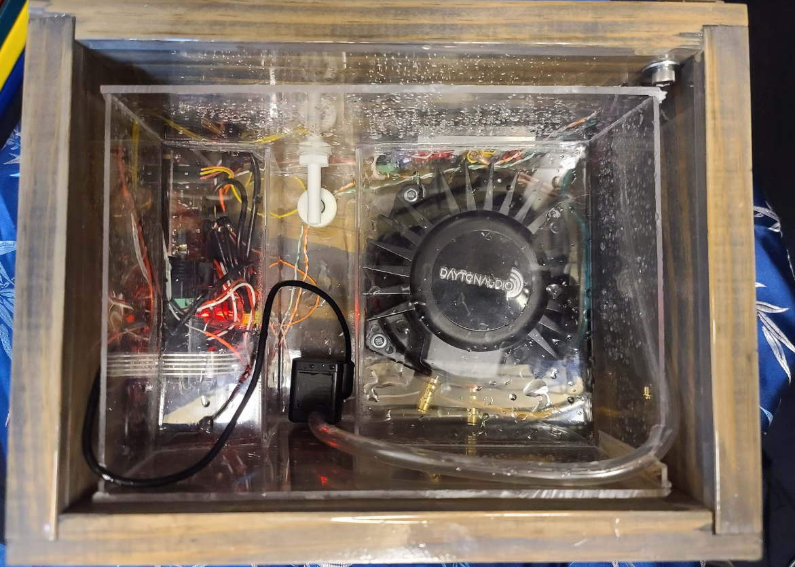

# First-time setup

This page describes how to set up a CloudLamp shipped partially disassembled.

## Basic assembly

The main lamp body is the largest piece with the base, pole, and reservoir already assembled together.  Remove it from the box and remove the packing material.  Remove all the blue masking tape.  Remove the lid of the base and make sure nothing looks obviously out of place, and the acrylic basin is not cracked:

Replace the base's lid and find the shade (wireframe structure with an LED strip).  In the correct orientation, it just barely fits over the sky mount.  Place it onto the skymount and connect the three-pin connector on the right side as shown in the video below.  Make sure the slots of all four of the shade's cross bars seat all the way down into the skymount's sides as shown in the video; you may have to push slightly to get this fit.

With a piece of soft tape like duct tape (not included), tape the other connector end to the skymount so it won't rattle.

## Make sure it works

### Basic functions

Find the power supply and plug it into the center of the back of the base.  Test the lamp's "sunlight", "sunset", and "storm" modes; here is what the lamp should do:

| Button | Result                                                       |
| ------ | ------------------------------------------------------------ |
| 4      | Puts lamp in "sunlight" mode if not already in sunlight mode, or turns lamp off (flashes red) if already in sunlight mode.  In sunlight mode, the left dial adjusts the brightness and the right dial does nothing. |
| 3      | Puts lamp in "sunset" mode if not already in sunset mode, or turns lamp off (flashes red) if already in sunset mode.  In sunset mode, the left dial adjusts the speed of the sunset; all the way left results in a [30 minute](cloud/sunset.ino) sunset, all the way to the right results in a 15 second sunset.  After the sunset is complete, the lamp will stay dark in sunset mode until changed.  The right dial does nothing in sunset mode. |
| 2      | Puts lamp in "storm" mode if not already in storm mode, or turns lamp off (flashes red) if already in storm mode.  In storm mode, the left dial adjusts lightning bolt frequency; all the way left produces bolts with an average spacing of [15 seconds](cloud/storm.ino), all the way right results in bolts with an average spacing of 1 second.  Actual spacings are random (following an [exponential distribution](https://en.wikipedia.org/wiki/Exponential_distribution)) and may be much shorter or much longer than the average.  The right dial adjusts the volume of the thunder. |
| 1      | Turns pump on or off.  The pump will only operate when there is enough water in the basin; if this button is pressed to turn on the pump when there is not enough water in the basin, the cloud will flash yellow and the pump will only start after water has been added. |

### Rattles

When in storm mode, turn up the thunder volume about half way.  Listen for any rattles from the lamp.  For any rattle, try to find where it is coming from.  Hold it with your finger to verify that it stops when held.  Try shifting things around to stop the rattle.  If the rattle is coming from the reservoir (the white box in the skymount) touching the skymount edge, try pushing it a millimeter or two away from the skymount.  If the rattle is coming from two of the wireframe wires vibrating against each other, try bending them slightly to reduce the rattle.  Rattles past about 60% volume may be unavoidable.

### Water

After everything else looks good, ensure that the base is on a fairly level surface (or else the rain will not fall into the hole in the base lid) and add distilled water to the basin in the base.  The well should be filled, but water shouldn't go more than about a centimeter up the left & right outer walls of the basin.  About 4 cups is ideal, but 3-5.5 should be fine.  Less than 3 and the pump may not be strong enough to pump water into the cloud reservoir.  Less than 1.5 and the water level sensor will not allow the pump to start.  More than 5.5 and there is a risk the cloud reservoir may overflow eventually.

After adding water and ensuring the base lid is on (if the lid is off, the raindrop splashes will eventually make the base body too wet because the metal raindrop baffles will not prevent this), press button 1 to turn on the pump.  You should be able to watch the part of the tube in the cloud going from the aluminum upright into the cloud reservoir (white plastic box) and see the water start going through that section.  After 10-45 seconds, the cloud reservoir should starting raining.  After turning off the pump, the rain will continue until the cloud reservoir is empty; this can be up to a few minutes.

## Add cloud skin

Included with the lamp are two bags with cotton rolls.  The larger bag can simply be unrolled into a length of cotton.  The smaller bag needs to have its hanger removed -- untwist the hanger and remove it entirely from the cotton, trying to minimize how much the cotton is pulled apart during this process.  After the hanger is removed, the cotton can be unrolled similarly to the large bag.

Wrap one of the cotton rolls (probably the smaller bag first) around the shade.  Make sure that the bottom of the shade is covered and the cotton can be wrapped back underneath the large opening at the bottom, but make sure no cotton remains in the path of the rain.  Cotton seams can be joined by rolling the two layers in your fingers.  Add the second cotton roll to fill in the uncovered areas of the shade.  Turn on the lamp to "sunlight" mode and try to obscure any LEDs that are clearly visible as dots through the cotton by adding some additional cotton in front of them.  Make some interesting artistic patterns in the cotton by pulling and stretching as desired.

Double check that no cotton remains in the path of the rain.

Now your lamp is all set up!